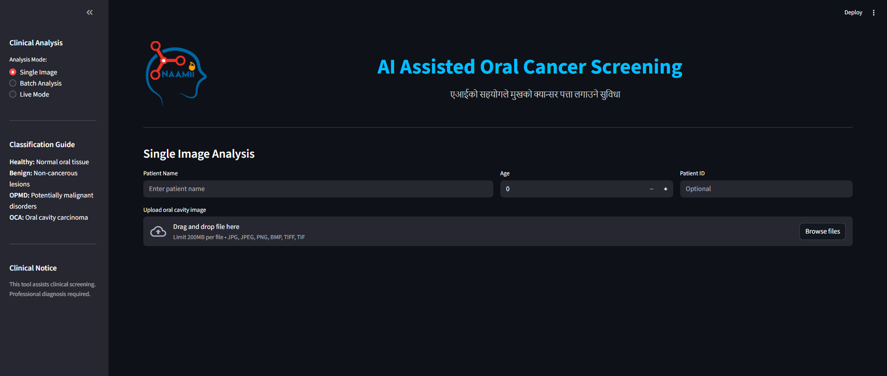

# 🦷 AI-Assisted Oral Cancer Screening Web App



**Empowering early detection through AI-driven oral health screening**

This web application provides an intelligent, user-friendly interface for screening oral cavity images using deep learning model (YOLO-based). It assists clinicians and community health workers in detecting oral abnormalities such as Benign Lesions, Oral Potentially Malignant Disorders (OPMD), and Oral Cavity Carcinoma (OCA) — directly from uploaded or live-captured images.

---

## 🚀 Key Features

- **🧠 AI-Powered Detection** – Real-time analysis using YOLO deep learning models

- **📸 Multiple Input Modes**
  - **Single Image Mode** – Upload and analyze one image.
  - **Batch Analysis Mode** – Upload multiple images or a ZIP folder for bulk screening.
  - **Live Mode** – Capture directly via webcam or iPhone Continuity Camera.

- **📊 Automatic Report Generation** – Generates color-coded risk assessments and downloadable medical PDF reports.

- **🌐 Bilingual Support** – English report text with Nepali impressions and visual guidance.

- **🧾 Batch Export** – Download all findings as CSV or PDF in one click.

- **🖼️ Interactive Visualization** – Displays annotated images highlighting detected lesions.

---

## 📁 Project Structure

```
Oral Cancer/
├── app/                           # Main application package
│   ├── __init__.py
│   ├── app.py                     # Streamlit application entry point
│   ├── config.py                  # Configuration and paths
│   ├── utils.py                   # Utility functions
│   ├── yolo_inference.py         # YOLO inference engine
│   └── requirements.txt           # Application dependencies
│
├── assets/                        # Static assets
│   ├── models/
│   │   └── best.pt                # Trained YOLO model
│   └── images/
│       ├── logo.png               # Application logo
│       └── nepali_*.png           # Nepali language impression images
│
├── scripts/                       # Utility scripts
│   └── modify_annotations.py      # Annotation processing script
│
├── notebooks/                     # Jupyter notebooks
│   └── Oral_Cancer_Detection_Final.ipynb
│
├── requirements.txt           # Training dependencies
│
├── data/                          # Data directory
│   └── Annotation.json
│
├── .gitignore
├── README.md
```

---

## ⚙️ Installation Guide

### 1️⃣ Clone the Repository

```bash
git clone <your-repository-url>
cd Oral-Cancer-Screening
```

### 2️⃣ Create a Virtual Environment

```bash
# For Mac/Linux
python3 -m venv venv
source venv/bin/activate

# For Windows
python -m venv venv
venv\Scripts\activate
```

### 3️⃣ Install Dependencies

For running the application:
```bash
cd app
pip install -r requirements.txt
```

For training (optional):
```bash
cd training
pip install -r requirements.txt
```

### 4️⃣ Add the YOLO Model

Place your trained YOLO model file (`best.pt`) inside:

```
assets/models/best.pt
```

### 5️⃣ Run the Web App

```bash
cd app
streamlit run app.py
```

Then open your browser at:

```
http://localhost:8501
```

---

## 🧠 AI Model Details

- **Model Type:** YOLOv8 (custom trained for oral lesion detection)
- **Classes:** Healthy, Benign, OPMD, OCA
- **Frameworks Used:** PyTorch, OpenCV, Streamlit, ReportLab
- **Device Support:** GPU (CUDA) & CPU fallback

---

## 📋 Example Output

| AI Diagnosis | Confidence | Risk Assessment | Clinical Recommendation |
|-------------|------------|----------------|------------------------|
| Oral Cavity Carcinoma | 96.7% | 🔴 High Risk | Immediate oncology consultation |
| OPMD | 84.3% | 🟠 Medium Risk | Specialist referral and biopsy consideration |
| Benign Lesion | 92.1% | 🟡 Low Risk | Routine follow-up recommended |
| Healthy | 99.2% | 🟢 No Risk | Maintain oral hygiene |

---

## 🏗️ Tech Stack

| Component | Technology |
|-----------|-----------|
| Frontend | Streamlit |
| AI Engine | YOLOv8 (PyTorch) |
| Image Processing | OpenCV, NumPy, PIL |
| Report Generation | ReportLab |
| Data Management | Pandas |
| Deployment | Localhost / Streamlit Cloud / Custom Server |

---

## 🧾 Generated Reports

Each analysis automatically generates:

- ✅ Annotated lesion image
- ✅ Clinical summary (Diagnosis, Risk, Referral)
- ✅ English + Nepali impression
- ✅ Downloadable PDF report

---

## 🔧 Configuration

All configuration is centralized in `app/config.py`:
- Model paths
- Class names and mappings
- Color schemes for visualization
- Default confidence and IoU thresholds
- Referral and risk assessment mappings

---

## 📝 Usage Notes

- Ensure `best.pt` model file is in `assets/models/`
- All paths are relative and cross-platform compatible
- The application supports both CPU and GPU inference
- For best performance, use GPU (CUDA) when available

---

## 🤝 Contributing

Contributions are welcome! Please feel free to submit a Pull Request.
---

> **"Early detection saves lives — with AI, we can make it accessible to everyone."**
